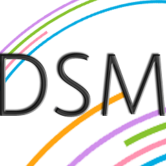

## About DSM
###### Build Status 

###### Test Servers  

###### Production Servers  

**DSM** is an middleware management and reporting tool designed to be strong and simple. It is build with C#. It can be used to collect IIS Site info,bindings,logs,site backends and more...

The product represents a big suite of middleware management tools that can help you easily watch and manage your services. 

## Technical Support or Questions

If you have questions or need help integrating the product please [contact us](https://www.d-teknoloji.com.tr).

## Contributing to DSM
Follow the [contributing](CONTRIBUTING.md) file.

## Licensing

DSM is **licensed** under the **[GNU/GPL v3 License]**.

[GNU/GPL v3 License]: https://github.com/DogusTeknoloji/DSM-UI-Solution/blob/master/LICENSE
